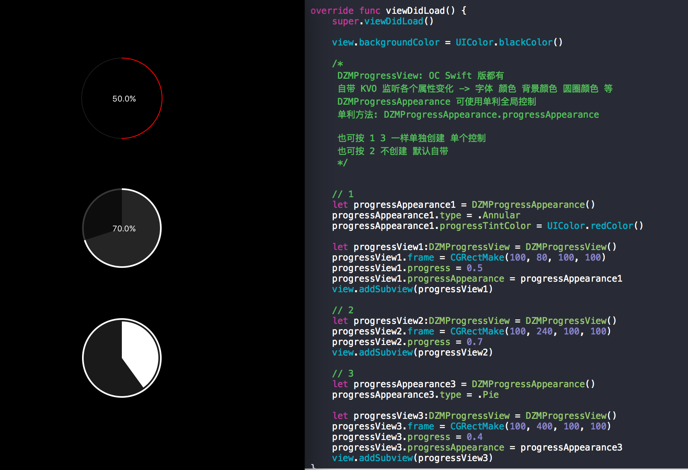

# DZMProgressView-Swift

swift 版本 进度条 自带 KVO 监听各个属性变化 -> 字体 颜色 背景颜色 圆圈颜色 等
下面有使用方式

/*
DZMProgressView: OC Swift 版都有
自带 KVO 监听各个属性变化 -> 字体 颜色 背景颜色 圆圈颜色 等
DZMProgressAppearance 可使用单利全局控制
单利方法: DZMProgressAppearance.progressAppearance

也可按 1 3 一样单独创建 单个控制 
也可按 2 不创建 默认自带
*/

// 1
let progressAppearance1 = DZMProgressAppearance()
progressAppearance1.type = .Annular
progressAppearance1.progressTintColor = UIColor.redColor()

let progressView1:DZMProgressView = DZMProgressView()
progressView1.frame = CGRectMake(100, 80, 100, 100)
progressView1.progress = 0.5
progressView1.progressAppearance = progressAppearance1
view.addSubview(progressView1)

// 2
let progressView2:DZMProgressView = DZMProgressView()
progressView2.frame = CGRectMake(100, 240, 100, 100)
progressView2.progress = 0.7
view.addSubview(progressView2)

// 3
let progressAppearance3 = DZMProgressAppearance()
progressAppearance3.type = .Pie

let progressView3:DZMProgressView = DZMProgressView()
progressView3.frame = CGRectMake(100, 400, 100, 100)
progressView3.progress = 0.4
progressView3.progressAppearance = progressAppearance3
view.addSubview(progressView3)